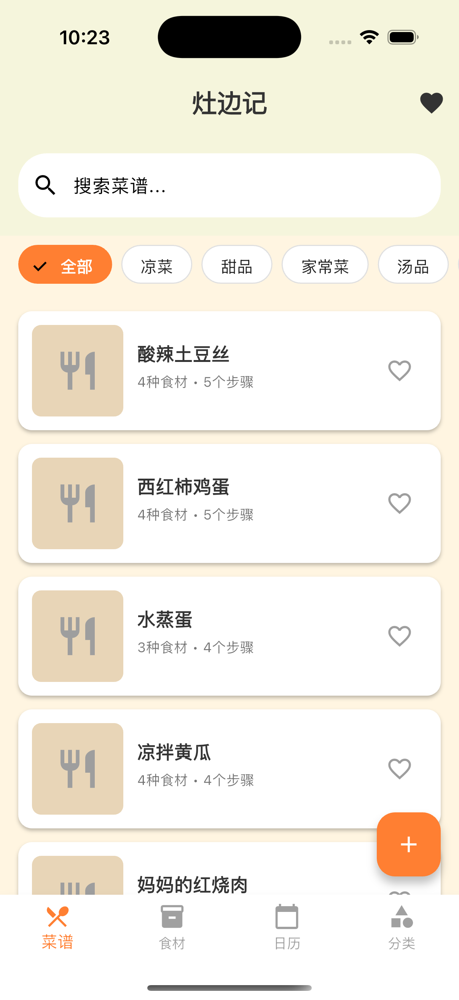
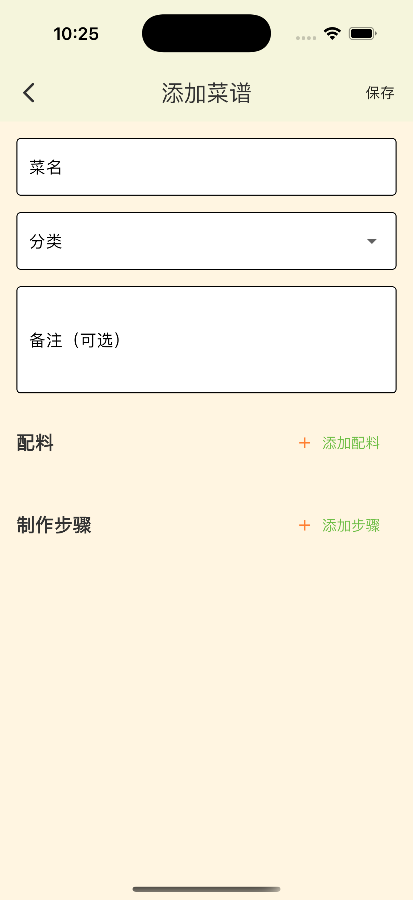
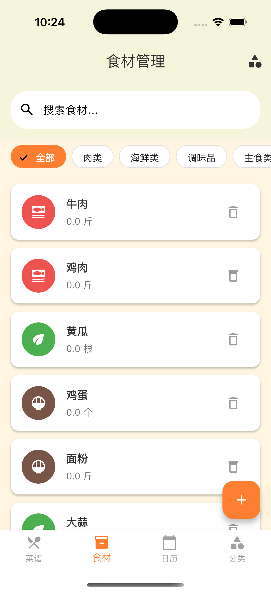

# 灶边记 (Kitchen Notes)

一个专注于本地菜谱管理的跨平台应用，帮助用户快速记录、整理、搜索菜谱，支持分类管理和制作步骤记录。支持 iOS、Android、macOS、Windows、Linux 和 Web 平台。

## 📸 应用截图

<div align="center">
  
  
  
  
</div>

<div align="center">
  
  
</div>

<div align="center">
  <em>现代化深绿色主题设计，简洁直观的用户界面</em>
</div>

## 功能特性

### 📖 菜谱管理
- 菜谱添加、编辑、删除
- 按菜名/分类/食材搜索
- 分类管理（家常菜、凉菜、甜品等）
- 图文混排步骤展示
- 菜谱等级和制作次数记录

### 🥬 食材管理
- 食材分类管理（蔬菜、肉类、海鲜等）
- 库存记录（名称、数量、单位）
- 保质期提醒
- 内置常见食材库

### 📅 做菜日历
- 月份日历视图
- 制作记录管理
- 图片上传支持
- 制作心得记录
- 评分系统

### 🎨 现代化设计
- 深绿色主题配色
- 简洁现代的UI设计
- 流畅的交互体验

## 技术栈

- **框架**: Flutter 3.6.2+
- **状态管理**: Provider
- **本地存储**: SQLite
- **图片处理**: image_picker
- **搜索**: 拼音匹配支持

## 依赖包

```yaml
dependencies:
  provider: ^6.1.2          # 状态管理
  sqflite: ^2.4.1           # SQLite 数据库
  image_picker: ^1.0.7      # 图片选择
  path_provider: ^2.1.2     # 路径处理
  path: ^1.9.0              # 路径工具
  uuid: ^4.3.3              # UUID生成
  lpinyin: ^2.0.3           # 拼音搜索
```

## 快速开始

### 环境要求
- Flutter SDK 3.6.2+
- Dart SDK 3.0+

### 安装步骤

1. 克隆项目
```bash
git clone <repository-url>
cd kitchen_notes
```

2. 安装依赖
```bash
flutter pub get
```

3. 运行项目
```bash
# macOS
flutter run -d macos

# iOS
flutter run -d ios

# Android
flutter run -d android

# Windows
flutter run -d windows

# Linux
flutter run -d linux

# Web
flutter run -d chrome
```

## 平台支持

| 平台 | 状态 | 说明 |
|------|------|------|
| 📱 iOS | ✅ 支持 | iPhone/iPad |
| 🤖 Android | ✅ 支持 | 手机/平板 |
| 💻 macOS | ✅ 支持 | Mac 桌面应用 |
| 🖥️ Windows | ✅ 支持 | Windows 桌面应用 |
| 🐧 Linux | ✅ 支持 | Linux 桌面应用 |
| 🌐 Web | ✅ 支持 | 浏览器应用 |

## 项目结构

```
lib/
├── main.dart                 # 应用入口
├── theme/                    # 主题配置
│   ├── app_colors.dart      # 颜色定义
│   └── app_theme.dart       # 主题配置
├── database/                 # 数据库层
│   └── database_helper.dart # SQLite 数据库助手
├── models/                   # 数据模型
│   ├── recipe.dart          # 菜谱模型
│   ├── ingredient.dart      # 食材模型
│   ├── category.dart        # 分类模型
│   └── cooking_record.dart  # 制作记录模型
├── providers/                # 状态管理
│   └── data_provider.dart   # 数据提供者
├── screens/                  # 页面
│   ├── main_screen.dart     # 主页面
│   ├── home_screen.dart     # 首页
│   ├── ingredient_management_screen.dart  # 食材管理
│   ├── cooking_calendar_screen.dart       # 做菜日历
│   └── recipe_category_management_screen.dart  # 分类管理
└── widgets/                  # 组件
    ├── recipe_card.dart     # 菜谱卡片
    ├── ingredient_card.dart # 食材卡片
    └── category_tabs.dart   # 分类标签
```

## 配色方案

- **背景色**: 现代浅灰白 (#F8F9FA)
- **次要背景**: 淡灰色 (#F1F3F4)
- **主色调**: 深绿色 (#2E7D32)
- **次要色**: 蓝色 (#1976D2)
- **强调色**: 现代红色 (#E53935)
- **高亮色**: 橙色 (#FF9800)
- **文字**: 深灰色 (#333333) / 淡灰色 (#A0A0A0)

## 开发计划

- [x] 基础UI框架
- [x] 菜谱CRUD功能
- [x] 食材管理
- [x] 做菜日历
- [x] 现代化配色
- [x] SQLite 数据库迁移
- [ ] 数据备份恢复
- [ ] 云同步功能
- [ ] 性能优化

## 📦 应用下载

### Android APK
- 📁 [下载地址](./assets/releases/) - 包含最新版本的 Android APK 文件
- 📱 支持 Android 5.0 及以上版本
- 📋 详细安装说明请查看 [发布说明](./assets/releases/README.md)

### 其他平台
- 🖥️ **桌面版**: 可通过源码编译 macOS、Windows、Linux 版本
- 🌐 **Web版**: 运行 `flutter run -d chrome` 体验在线版本
- 📱 **iOS版**: 需开发者证书，可通过源码编译

## 贡献

欢迎提交Issue和Pull Request来改进这个项目。

## 许可证

本项目仅供学习和个人使用。
